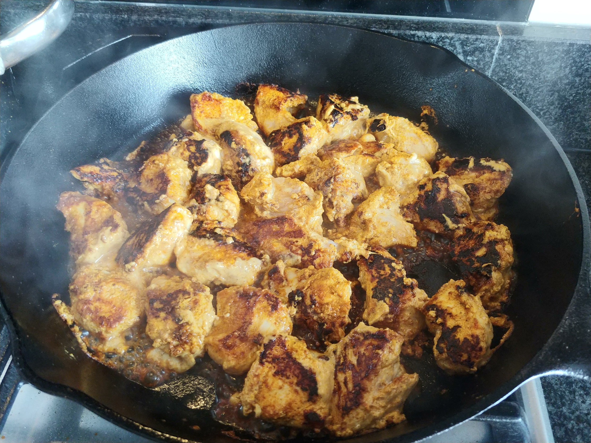
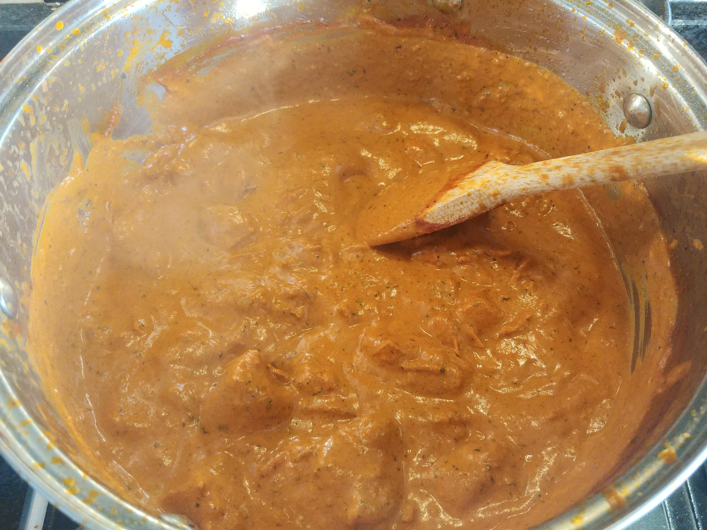
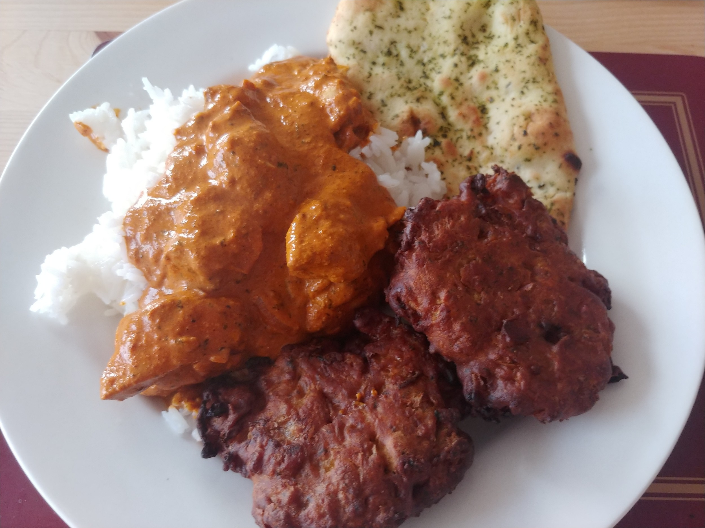

# Chicken Tikka Masala

Taken from: https://cafedelites.com/chicken-tikka-masala/

## Ingredients

### Chicken Marinade

- 3 Chicken Breast Fillets (~650g)
- 1 cup Yoghurt (~250ml)
- 1.5 Tbsp minced Garlic
- 1 Tbsp Ginger
- 2 Tsp Garam Masala
- 1 Tsp Turmeric
- 1 Tsp Ground Cumin
- 1 Tsp Kashmiri Chili
- 1 Tsp Salt

### Masala Sauce

- 2 Tbsp Butter
- 2 Onions
- 2 Tsp Brown Sugar
- 1.5 Tbsp Garlic
- 1 Tbsp grated Ginger
- 1.5 Tsp Garam Masala
- 1.5 Tsp Ground Cumin
- 1 Tsp Turmeric
- 1 Tsp Ground Coriander
- 400g Passata
- 1 Tsp Kashmiri Chili
- 1 Tsp Salt
- 1.25 Cup Double Cream (~300ml)
- Fresh Coriander (to garnish)

## Method

1. Mix all the marinade ingredients together in a bowl. Add diced chicken and mix in. Marinate for 1-24 hours in the fridge.
2. Heat some oil in a large cast iron skillet over medium-high heat. When sizzling add the chicken pieces in batches (so as not to crowd the pan).
3. Fry the chicken until browned (about 3 mins each side), then set aside and keep warm.
4. Melt butter in a deep pot. Slowly fry the onion, sprinkle with a teaspoon of sugar, cook until soft
5. Add garlic and ginger and sauté for 1 minute until fragrant, then add garam masala, cumin, turmeric and coriander. Fry for about 20 seconds until fragrant, while stirring occasionally.
6. Pour in the tomato puree, chili powders and salt. Let simmer for about 10-15 minutes, stirring occasionally until sauce thickens and becomes a deep brown red colour.
7. Stir the cream and 1 teaspoon of sugar through the sauce. Add the chicken and its juices back into the pan and cook for an additional 8-10 minutes until chicken is cooked through and the sauce is thick and bubbling. (Add some water if too thick)
8. Serve and garnish with coriander.

## Photos

