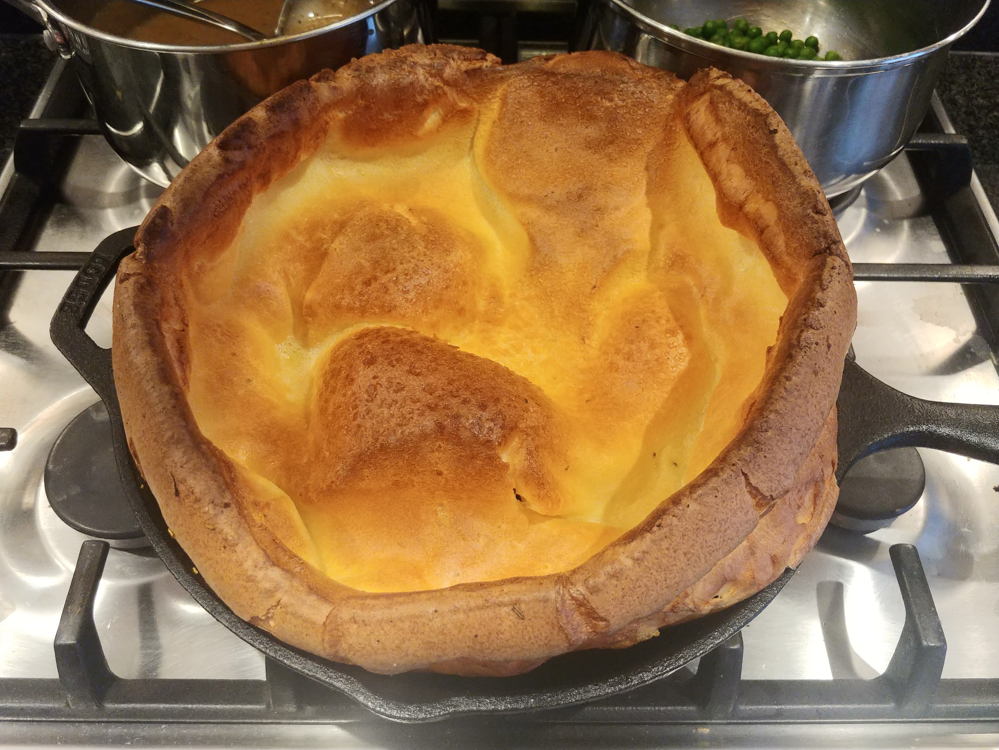
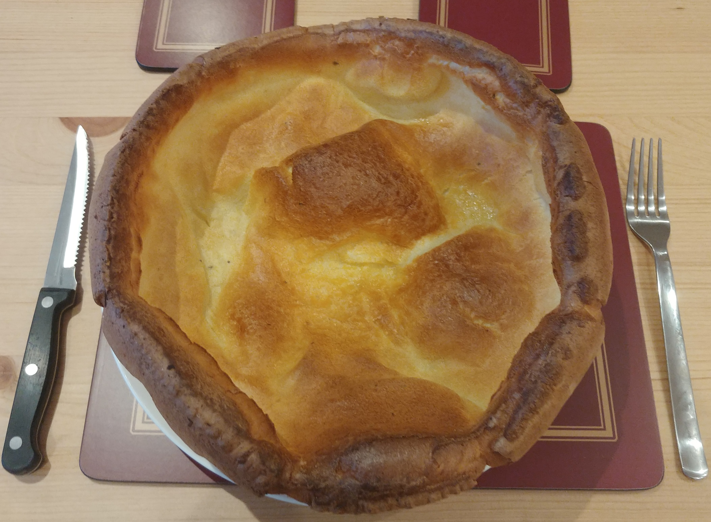

# Giant Yorkshire Dinner

## Ingredients

Very large Yorkshire - for 10.25" Skillet:
- 90g flour
- 120ml milk
- 2-3 eggs (depending on size)

Large Yorkshire - for medium dish ~7":
- 45g flour
- 60ml milk
- 1-2 eggs

Roast Ingredients:
- Beef roasting joint
- 1 Red Onion
- Thyme
- Rosemary
- Flour
- Beef Stock
- Carrots
- Marris Piper Potatoes
- Parsnips
- Peas

## Method

For the Beef see [Roast Dinner - Beef](./roast_dinner.md#beef) 

For the Vegetables see [Roast Dinner - Vegetables](./roast_dinner.md#vegetables) 

For the Gravy see [Roast Dinner - Gravy](./roast_dinner.md#gravy) 

### Yorkshire

1. Heat oven to 220°C, fan 200°C, gas 7.
2. Pour flour into a bowl, add salt and pepper
3. Make a well in the middle, crack eggs into it
4. (Electric) whisk it together, whilst slowly adding the milk
5. Add lard to skillet, and heat in oven for 5 mins
6. Pour batter into the skillet and tranfer to oven for 20-25 mins or until good colour.

## Photos

