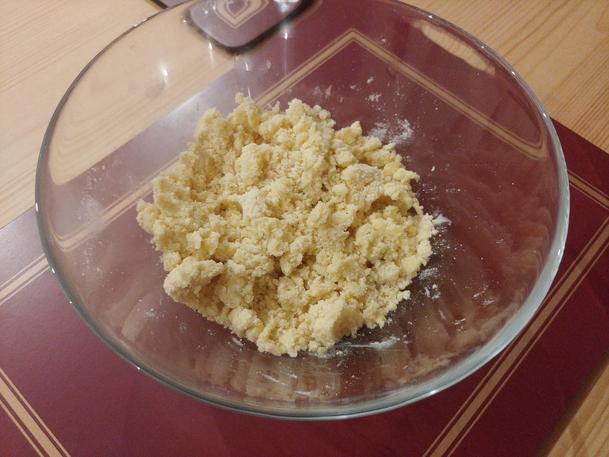
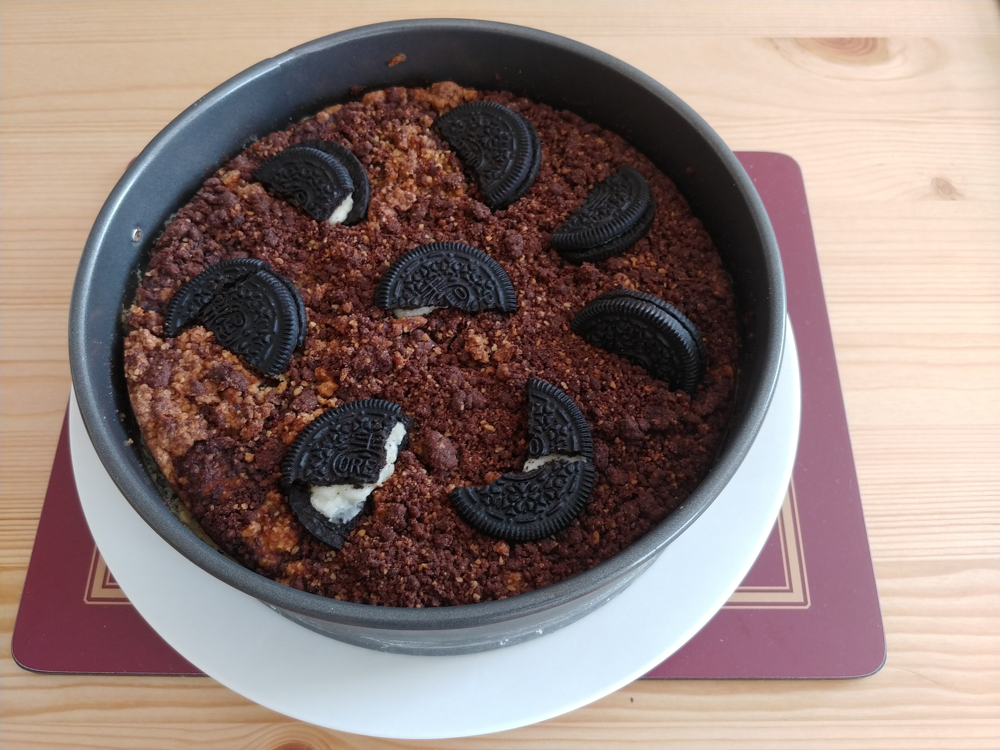
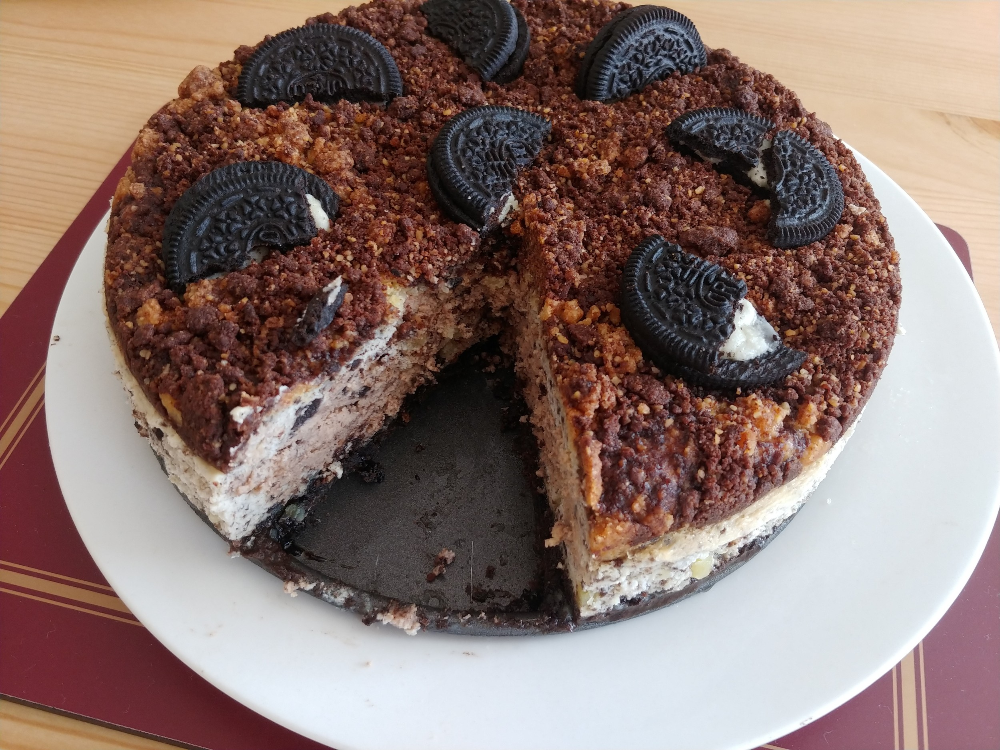

# Oreo Crumble Cheesecake

https://www.xiaohongshu.com/discovery/item/60c1c89a000000002103a122

https://www.xiaohongshu.com/discovery/item/607c13dc000000002103b417

http://www.kipkipfun.com/food/super-delicious-oreo-cheese-cake

## Ingredients

### Crumble

- 70g Plain Flour
- 60g Almond Powder
- 100g Butter
- 20g Powdered Milk
- 35g Caster Sugar
- 10g Cocoa Powder

### Biscuit Base

- 2 Packets Oreos (300g)
- 70g Butter

### Filling

- 400g Cream Cheese
- 75g Caster Sugar
- 150g Greek Yogurt
- 20g Cornflour 
- 2 Eggs
- 150g Double Cream
- 1 Packet Oreos (150g)
- 80g Milk/Dark Chocolate

## Method

### Crumble

1. Mix the flour, almond powder, milk powder, and sugar together.
2. Seperate into two bowls. Add the cocoa powder to just one of them.
3. Divide the butter between the two of them.
4. Allow the butter to soften. Then rub them with your hands to form larger particles. Store in refrigerator.

### Base

1. In a food processor or blender pulse the oreos to crumbs.
2. Melt the butter in a pan, then mix in the oreo crumbs.
3. Put into the cheesecake tin, compact, then refrigerate.

### Filling

1. Add the sugar to the cream cheese in a bowl and mix.
2. Add the yoghurt, eggs, cornflour, mixing in each one at a time.
3. Whip the cream and then mix in.
4. Crush half of a packet of the oreos and mix in.
5. Divide the filling into two bowls. Melt the chocolate and add to one of them.
6. Pour the two filling mixes into the tin, in layers.

### Cooking

1. Add the remaining half packet of oreos on the top of the cheesecake.
2. Place in oven in a hot water bath at 175°C for 50 minutes
3. Take it out and let it cool.
4. Put in refrigerator for 4 hours.

## Photos

