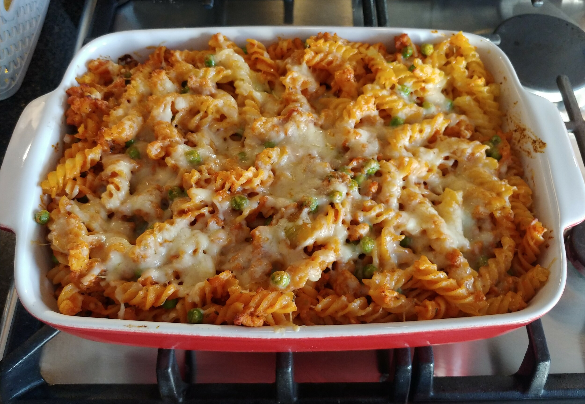

# Sausage Pasta Bake

Recipe inspired by my friend Josh

## Ingredients

- ~500g Sausage Meat
- 2 Onions
- 400g Fusilli Pasta
- 500g Passata / Chopped Tomatoes
- Cheddar Cheese
- Italian Hard Cheese / Parmesan
- 1 tsp Italian Herb Mix / Oregano (70%), Thyme, Basil (5%), Parsley
- Garlic
- Peas

## Method

1. Preheat oven to 200°C
2. Bring a large saucepan of water with a pinch of salt to the boil
3. Add the onion, garlic and the meat to a large frying pan on medium heat for 10-15 mins
4. Add the pasta to the boiling water, cook until al dente: approx 8-10mins
5. When the pasta is cooked drain in a colandar, drizzle with a little oil to stop it sticking
6. Add the tomato, and herbs to the pan, cook on low for about 8 mins
7. Add the peas to the pan for a couple of mins
8. Combine the pasta and the tomato mix together, then transfer to a ovenproof dish.
9. Sprinkle cheddar cheese, and then Italian hard cheese
10. Tranfer to oven for 8-10 mins.

## Photos

