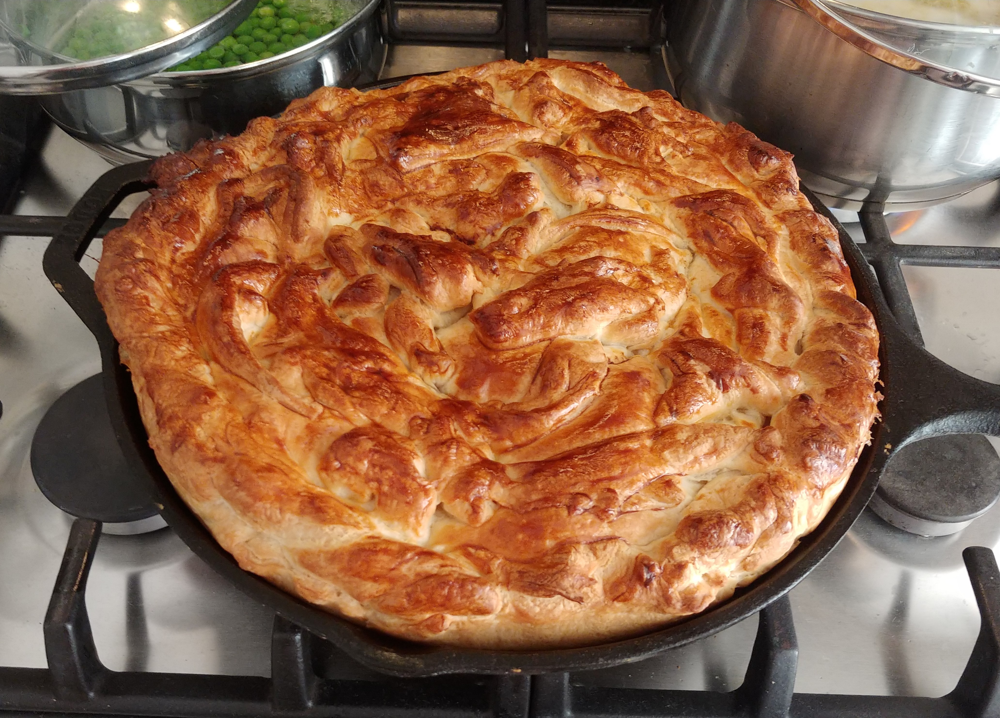

# Steak, Ale, and Cheese Pie

Adapted from:

https://recipes.lidl.co.uk/Recipes/Traditional-steak-pie

## Ingredients

- ~600g Diced Beef Steak
- ~30g Flour
- ~2 Red Onions
- ~2 Carrots
- ~2 Parsnips
- ~500ml Bottle of IPA
- ~170ml Beef Stock
- 2x Puff Pastry Ready Rolls
- Mature Cheddar Cheese
- Blue Stilton
- 1 Egg

For sides:
- White Potatoes
- Peas

## Method

1. Put the beef into a bowl and add the flour and a little seasoning, mix together until the cubes are evenly coated.
2. Place a large pot on the hob over a medium heat. Add the oil to heat up, then add a portion of the beef to the pan to brown. Remove with a slotted spoon and set aside, repeating the process until all the beef has browned.
3. Add the vegetables to the pot. Stir thoroughly to coat in the oil and beef juices and allow to cook for a couple of minutes.
4. Return the beef to the pan and stir to combine.
5. Mix the beer through the stock, then pour into the pan and stir well. Increase the heat and bring the mixture up to the boil.
6. Once boiling, put the lid mostly on the pan, turn down the heat to low and cook for about 2 hours 30 minutes, until the  meat is tender and falls apart and the mix has thickened up.
7. When ready to cook, preheat the oven to 220°C/200°C fan/gas mark 7.
8. Cover a 10.25" cast iron skillet with a very thin layer of oil. Cover base of skillet with pastry.
9. Fill the skillet with the pie mixture. Then sprinkle the cheese over the top.
10. Cover the top of the skillet with a pastry lid. Brush with beaten egg.
11. Cook for 30 minutes.
12. Stand for at least 10 minutes - the longer you wait the easier it will be to serve.
13. Serve with mashed potatoes and peas.

## Photos

