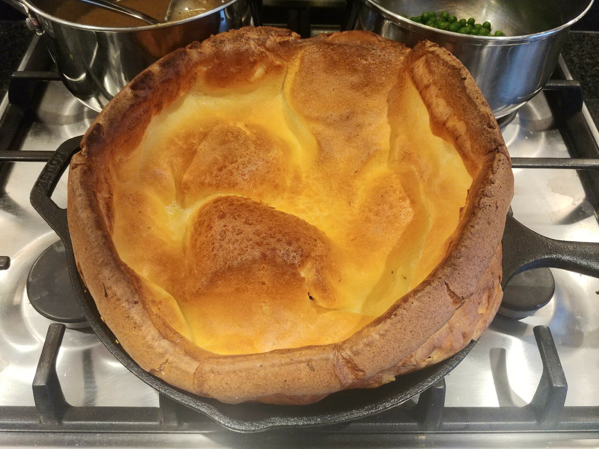
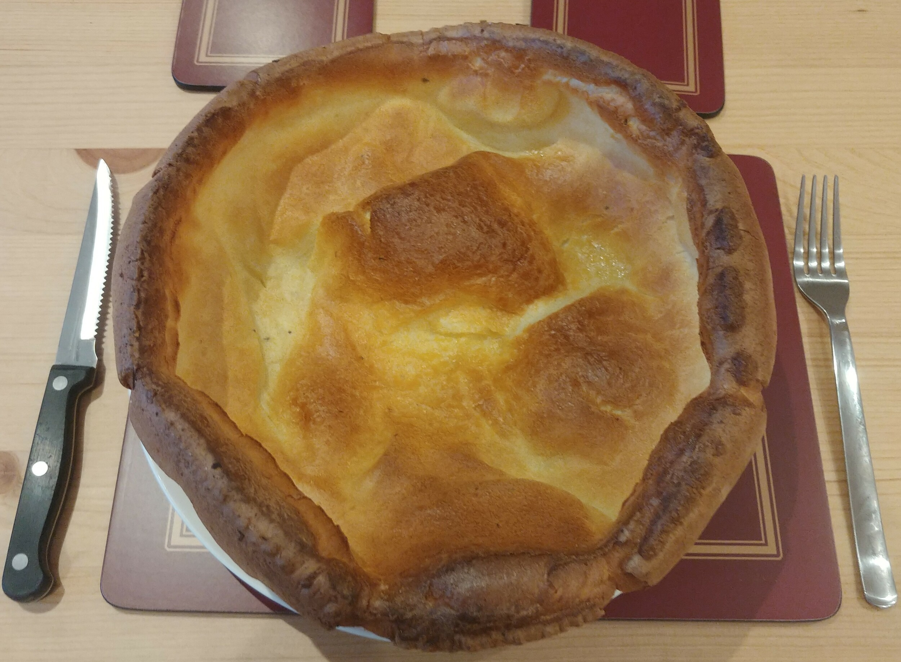
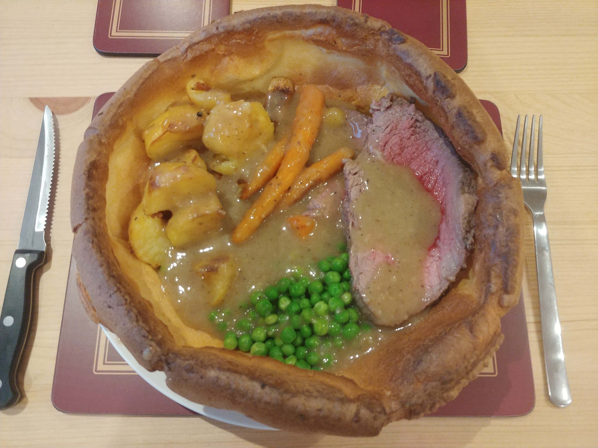

# Giant Yorkshire Pudding

## Ingredients

Giant Yorkshire - for a 10.25" Skillet:
- 90g flour
- 120ml milk
- 2-3 eggs (depending on size)

Big Yorkshire - for medium dish ~7":
- 45g flour
- 60ml milk
- 1-2 eggs

## Method

### Yorkshire

1. Heat oven to 220°C, fan 200°C, gas 7.
2. Pour flour into a bowl, add salt and pepper
3. Make a well in the middle, crack eggs into it
4. (Electric) whisk it together, whilst slowly adding the milk
5. Add sunflower oil to skillet, and heat in oven for 5 mins
6. Pour batter into the skillet and tranfer to oven for 20-25 mins or until good colour.

## Photos

